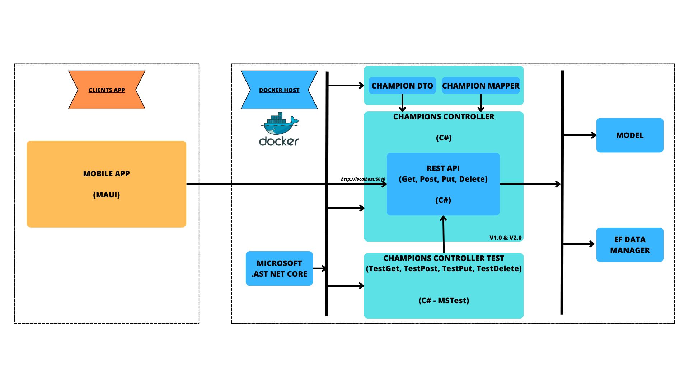
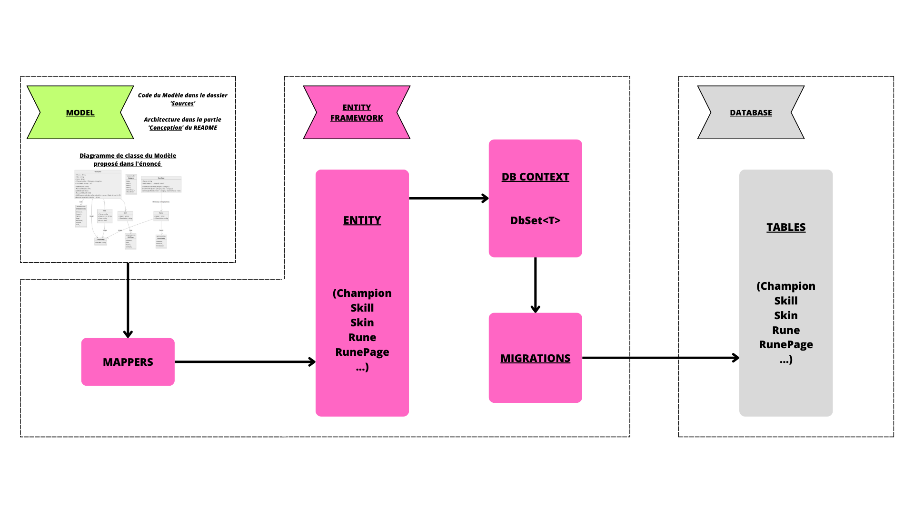
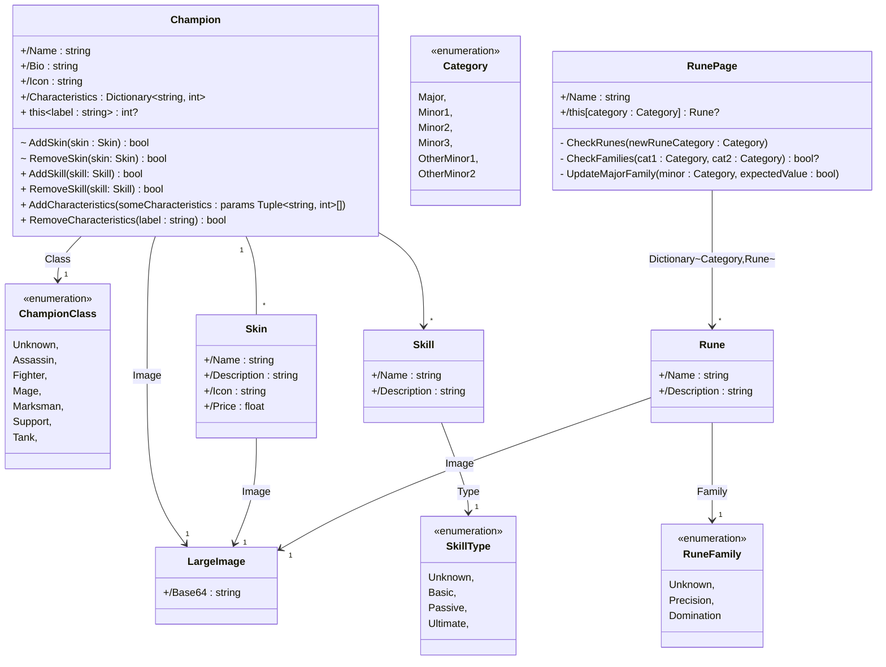
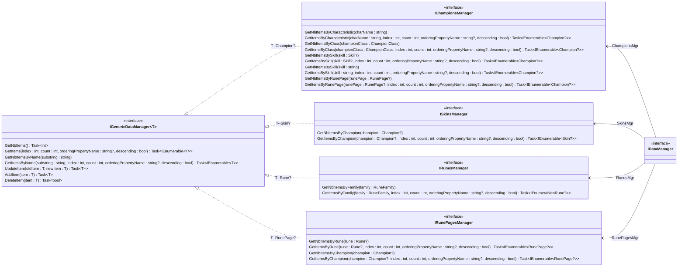
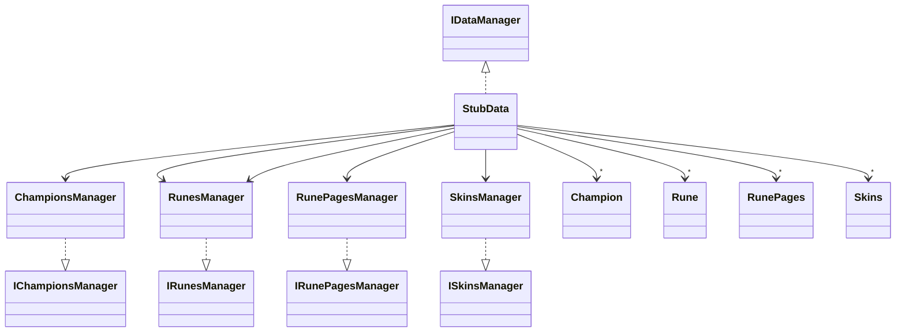

# **MY CHAMPIONS**

## Bonjour et bienvenue sur le dépôt du projet MyChampions ! 👋

---

Sommaire 
 1. [Accessibilité](#acces)
 2. [Progression](#progression)
 3. [Présentation du projet](#presentation)
 4. [Contenu](#contenu)
 5. [Architecture](#architecture)
    1. [API](#api)
    2. [L'API dans notre projet](#api_projet)
    3. [EF](#ef)
    4. [L'EF dans notre projet](#ef_projet)
    5. [Lien entre EF et API](#link_ef_api)
    6. [Lien entre l'API et l'application MAUI](#link_api_maui)
 6. [Conception](#conception)
 7. [Auteur](#auteur)

---

### Profiter dès maintenant d'un accès anticipé à MyChampions

> **Warning**: Le déploiement n'a pas encore été fait.   

Pour obtenir le code du projet, il est possible de cloner la branche `master` dans Visual Studio 2022.   

---

🚧  __EN PROGRESSION__

📆  _Fin du projet prévue :_ 26 Mars 2023   

Avancement :memo:  

- __TP 1__ (_Consommation et Développement de services_) : Premier Contrôleur `Champion`  
- __TP 1__ (_Entity Framework_) : Création d'une première classe `Champion`    
- __TP 2__ (_Consommation et Développement de services_) : Requêtes GET et POST + tests    
- __TP 2__ (_Entity Framework_) : Ajout de la liaison avec l'énumération `ClassChampion` + lien avec `Stub`    
- __TP 3__ (_Consommation et Développement de services_) : Ajustements tests + début mise en place drone.yml    
- __TP 3__ (_Entity Framework_) : Tests + Création début gestion `Skin`    
- __Vacances 1__ (_EF + Conso Services_) : Tentatives correction tests + CI en marche 
- __Vacances 2__ (_EF + Conso Services_) : Début tests API Console + début OneToMany 
- __Vacances 3__ (_EF + Conso Services_) : Container Deployment Fonctionnel     
- __TP 4__ (_Consommation et Développement de services_) : Travail sur Pagination et Filtrage Méthode `GET`      
- __TP 4__ (_Entity Framework_) : Créations Entity + OneToMany Fonctionnel avec tests OK         
- __TP 5__ (_Consommation et Développement de services_) : Création de `PUT` & `DELETE` + Gestion des exceptions dans Contrôleur        
- __TP 5__ (_Entity Framework_) : Ajouts de tests pour `Champion` et tests pour `Skin` - Réflexion de l'implémentation des `Skill` et de l'ensemble des `Runes` - Début ManyToMany          
- __TP 6__ (_Consommation et Développement de services_) : Ajout Logger Informations/Warning/Error dans Contrôleur + Début ajout Versioning + Reprise de `PUT` & `DELETE` avec tests + `GetSkinsByName` dans ChampionsController + début ajout EFDataManager    
- __TP 6__ (_Entity Framework_) : All `ManyToMany` Finis + Ajout de tous les `Mappers` + Mise en place de tous les test   
- __TP 7__ (_Consommation et Développement de services_) : Installations et mise à jour pour le client MAUI & avancement de l'`EFDataManager`      
- __TP 7__ (_Entity Framework_) : Ajout de données dans `Program.cs` & Déploiement de la Database + Création de toutes les interfaces de `EFDataManager`   
- __Maison__ (_EF + Conso Services_) : Ajout des autres contrôleurs + rédaction documentation     

---

### **Présentation**

MyChampions : votre guide des champions de League Of Legends ! :beginner:     

MyChampions est une application référençant les différents personnages du célèbre jeu de Riot Games : League Of Legends ainsi que les skins ou les runes existantes.   

*******

## Ressources :package:

- Temps
    - 23 Janvier au 26 Mars    
- Matériel
    - Ordinateurs portables sous Windows   
    - Visual Studio 2022    
- Langages utilisés
    - 
    - 
    - 

- Personne 
    - 1 étudiant en BUT Informatique

---

# **Description Architecture Globale Application : MyChampions** :globe_with_meridians:

---

## **API (Application Programming Interface)** :truck:

Une API est un moyen de mettre à disposition des ressources (données).
Dans ce projet, nous avons une API **RESTful** : URI (Uniform Resource Identifier) soit URL + encre

_Qu'est ce qu'une API **REST** ?_  
REST = REpresentational State Transfer :
- _Uniforme_ : l'interface est uniforme à tous les niveaux
- _Stateless_ : une API REST ne doit pas maintenir de session 
- _Client/Server ("Separation of Concerns")_ : l'API REST n'est pas concerné par l'affichage, les interactions utilisateur et la session
- _Layered_ : La présence de "connecteurs" intermédiaires doit être implicite pour le client et le serveur

### **ChampionsController**

Nous avons principalement travaillé dans cette partie sur le contrôleur de la classe `Champion`.  

Un contrôleur représente des routes et des ressources. Il s'agit dans notre cas plus précisément d'un contrôleur d'API avec ajout écriture/lecture.  
Nous avons donc mis en place dans celui-ci l'utilisation des verbes **HTTP** : 
- _GET_ : récupérer une ressource
- _POST_ : créer une ressource
- _PUT_ : mettre à jour une ressource
- _DELETE_ : supprimer une ressource

Afin de mettre cela en place nous avions besoin d'un `ChampionDTO` (Data Transfer Object) qui permet d'avoir la maîtrise de ce qu'on expose dans l'API.   
Cependant, il est primordial de pouvoir passer simplement du `ChampionDTO` au `Champion` et c'est pour cela que nous avons également développer un `ChampionMapper`.   

En plus des quatre verbes dont nous avons parlé plus tôt, nous avons également dû mettre en place plusieurs autres fonctionnalités pour apporter des éléments en plus à notre API comme le **Filtrage** pour choisir qu'une partie des données ou la **Pagination** pour retrouver un certain nombre précis de Champion par page.

### **TestChampionsController**

Au delà de simplement mettre en place un contrôleur, il est important également de le tester pour s'assurer de son bon fonctionnement.   
Nous avons fait le choix dans cette partie de simplement faire des _tests d'intégration_ (tester une fonctionnalité ou un assemblage) et des _tests unitaires_ (tester un bout d'une méthode).  
Nous utilisons pour cela le Framework **MSTest** afin de tester chacunes des opérations **CRUD** (Create, Read, Update, Delete).

Dans une optique de qualité de développement, nous avons également essayé de privilégier dans notre code et notamment dans celui de notre contrôleur l'utilisation de **Logs**.  
Ces derniers permettent de récolter des informations ou des avertissements lors du déploiement et de l'utilisation de notre code.

### **Déploiement de l'API**

Nous utilisons dans notre projet un **container Docker** pour stocker notre API.  
Le Dockerfile lié à cela va s'exécuter à chaque fois avec notre **CI** mise en place sur _Code#0_.

---

## **L'API dans notre projet** :truck:

Dans notre projet ASP.NET Core, l'API est un ensemble de routes, de contrôleurs et d'actions qui permettent aux utilisateurs de communiquer avec notre application à travers des demandes HTTP. En d'autres termes, une API définit les points d'entrée de l'application, les méthodes et les paramètres qui peuvent être utilisés pour interagir avec elle.   

Ici, nous souhaitons interagir surtout avec nos 5 types d'éléments principaux : les champions, les skins, les skills, les runes & les pages de runes.   

Nous avons donc pour chacun d'entre eux une classe `DTO` (Data Transfer Object). En somme, un DTO est un objet qui est utilisé pour transférer des données entre différentes parties d'une application. Il est conçu pour encapsuler un ensemble de données et les rendre disponibles à d'autres parties de l'application. L'utilisation de DTO peut présenter des avantages tels que la réduction de la quantité de données transférées, la simplification de la communication entre les différentes parties de l'application, l'amélioration des performances et la réduction de la complexité du code.   
En plus de cela, nous utilisons des `Mapper` afin de pouvoir passer finalement entre les différentes formes que peut prendre un champion par exemple entre les différentes parties du projet (Champion, ChampionDTO, ChampionEntity...).   

Nous pouvons grâce à cela définir notre `ChampionController` dans lequel sont définies toutes les actions liées aux champions et donc gérées par l'API. Ces actions dont nous avons parler précédemment vont être perfectionnées afin de répondre au mieux aux besoins de l'utilisateur. Par exemple, notre méthode `GET` permet également un *filtrage* par le nom et la *pagination* des données.   

C'est ensuite à cette **API** que notre Application Mobile va faire appel pour pouvoir requêter les multiples objets qu'elle contient.   

---

## **EF (Entity Framework)** :card_file_box:

Souvent appelé EF Core, Entity Framework est un **ORM** (Object Relational Mapper) qui a pour but de simplifier la création de tables et des requêtes de base de données. 

### **Classes `Entity`**

Une **Entity** en EF est une classe qui correspond à une table de base de données.  
On en retrouve ainsi une différente pour chaque classe du modèle (`Champion`, `Skin`, `Skill`, `RunePage`, `Rune`...).   

### **Classe `ChampionDBContext`**

La liaison entre les classes se fait elle au sein du **Context** principal.  

La classe de contexte représente une session avec la base de données sous-jacente.  
Une instance de la classe de contexte représente des modèles d'unité de travail et de référentiel dans lesquels elle peut combiner plusieurs modifications dans une seule transaction de base de données.  
La classe de contexte est utilisée pour interroger ou enregistrer des données dans la base de données. Elle est également utilisée pour configurer les classes de domaine, les mappages liés à la base de données, modifier les paramètres de suivi, la mise en cache, les transactions...  

Il faut savoir qu'il existe trois types de liaison principales entre deux classes :
- **One To One** : une entité d'un type est associée à une entité d'un autre type (_exemple : un champion appartient à un type_).   
- **One To Many** : une entité d'un type est associé à plusieurs entités d'un autre type (_exemple : un champion possède plusieurs skins mais un skin ne peut appartenir qu'à un seul champion_).
- **Many To Many** : les entités d'un type peuvent appartenir à plusieurs entités d'un autre type (_exemple : un champion à plusieurs skills et chaque skill peut appartenir à plusieurs champions_).

### **Classes `Mapper`**

Nous retrouvons, sensiblement comme dans la partie `API`, une classe pour passer du type `ChampionEntity` à `Champion`.  
Ceci peut notamment être utilisé dans les tests dont nous allons parler dès à présent.

### **Tests EF**

Nous effectuons en `Entity Framework` les tests unitaire d'une façon particulière appelée : **Testing In Memory**. Cela signifie que les données enregistrées en mémoire pour effectuer des tests seront effacées à la fin de ces derniers.

Nous utilisons personnellement le Framework **xUnit** afin de tester pour chaque classe Entity l'ensemble des opérations **CRUD** auxquelles nous pensons : _Get_, _Add_, _Modify_ & _Delete_.

---

## **L'EF dans notre projet** :card_file_box:

Le diagramme de classes montre que le modèle de données est composé de cinq entités principales : Champion, Skin, Skill, RunePage et Rune.   

On retrouve trois types de liaison dans notre modèle :   
- Les liaisons `One To One` : notamment entre les classes classiques et les énumérations leurs étant liées.
- Les liaisons `One To Many` : que l'on retrouve par exemple entre la classe `Champion` et `Skin` puisqu'un champion peut avoir plusieurs skins alors qu'un skin ne peut appartenir qu'à un champion.
- Les liaisons `Many To Many`: comme on le voit entre la classe `Rune` et la classe de `RunePage` avec une rune qui peut se trouver dans plusieurs pages de runes et une page de rune qui peut contenir plusieurs runes.    
Il faut savoir que la classe `Rune` a aussi une relation de Dictionnaire avec la classe `RunePage` que je n'ai pas encore implémenté.   

Nous avons besoin d'avoir toutes ces informations afin de pouvoir constituer les classes `Entity` qui nous permettront de constituer notre base de données.    

Nous retrouvons aussi le `DbContext`, nommé `ChampionContext`, qui est défini pour gérer les entités Champion, Skin, Skill, RunePage et Rune. Les entités sont mappées à des tables de la base de données à l'aide de DbSet, et les relations entre les entités sont définies dans la méthode OnModelCreating.   

Nous utilisons ensuite à partir de ce `Context` le principe de `Migrations` qui sont utilisées pour créer et mettre à jour la base de données.   

---

## **Le lien entre EF et API : l'EFDataManager** :thread:

D'abord, lorsque l'on utilise Entity Framework dans notre projet, on créé des classes qui représentent les tables de notre base de données et les relations entre elles comme expliqué plus tôt. Entity Framework génère ensuite les requêtes SQL nécessaires pour interagir avec la base de données et récupérer les données.

Avec ASP.NET Core, il est proposer d'utiliser *l'injection de dépendances* pour fournir des instances des classes générées par Entity Framework aux différentes parties de notre application. Cela permet de créer des instances de `ChampionContext` et de les utiliser pour interagir avec la base de données.

Au début, nous avons utilisé un **Singleton** (_on utilise toujours la même instance_) avec la paire **<IDataManager,StubData>**. IdataManager est une interface qui définit les méthodes serva,t à interagir avec les données, tandis que StubData est une implémentation de cette interface qui fournit des données simulées.

Cependant, une fois passé à Entity Framework avec un `Context` terminé, nous avons pu utiliser une implémentation différente de l'interface **IDataManager** pour interagir avec la base de données. Nous avons donc utilisé une nouvelle implémentation de cette interface, appelée **IEFDataManager**, qui utilise `ChampionContext` pour interagir avec la base de données.

Maintenant, il est aussi nécessaire de changer la portée de l'objet *IDataManager* de **Singleton** à **Scoped** (_on instancie un nouveau Stub quand le manager est demandé_). Cela signifie que chaque requête HTTP reçoit une nouvelle instance de l'objet *IDataManager*, qui est ensuite détruite lorsque la requête est terminée. Cela garantit que chaque requête dispose d'une instance séparée et que les données ne sont pas partagées entre les différentes requêtes.

---

## **Le lien entre l'API et l'application MAUI** :iphone:

L'application mobile que nous utilisons fournie par le sujet étant fait à partir de la version 7 de Core donc supérieure à celle du code que nous développons : la 6.   
Ceci a donc nécessité la création de deux solutions qui sont liées.   

---

## Détails de conception :building_construction:  

### Diagramme de classes du modèle

### Diagramme de classes des interfaces de gestion de l'accès aux données

### Diagramme de classes simplifié du Stub

*******

## Auteur :technologist:

Étudiant 2ème Annnée - BUT Informatique - IUT Clermont Auvergne - 2022-2023   
`BRODA Lou`